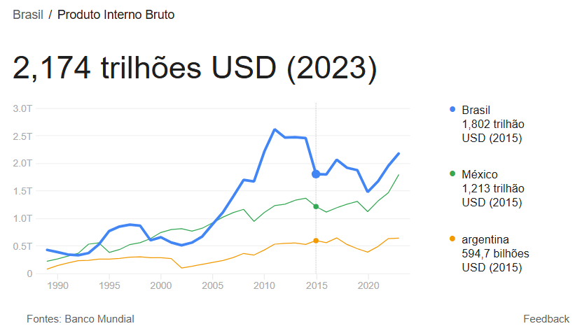
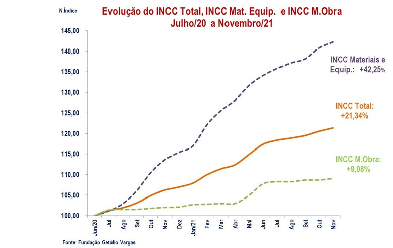
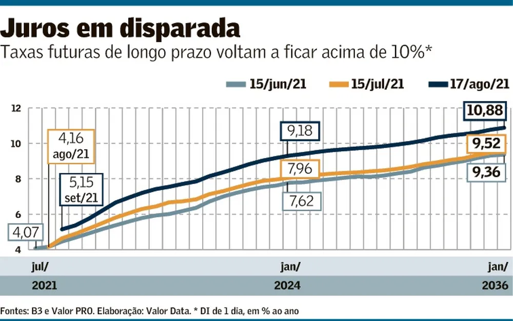
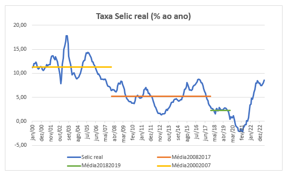
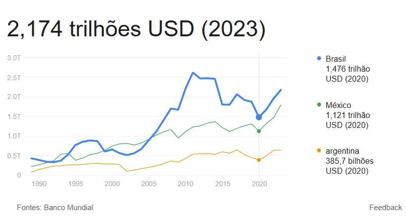
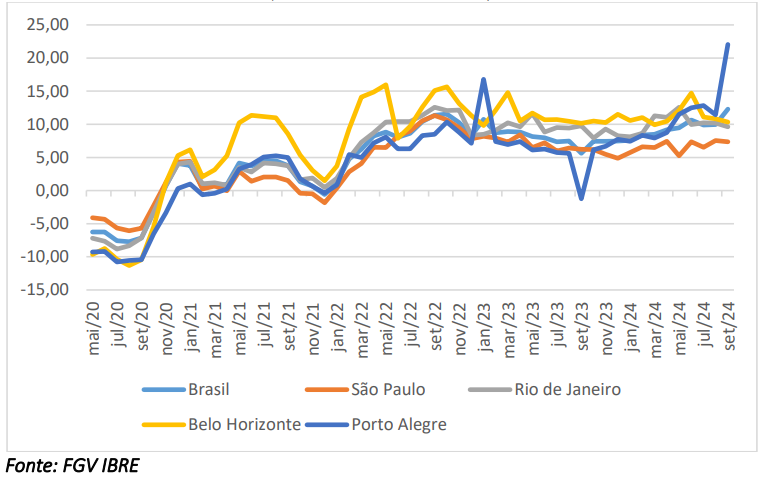
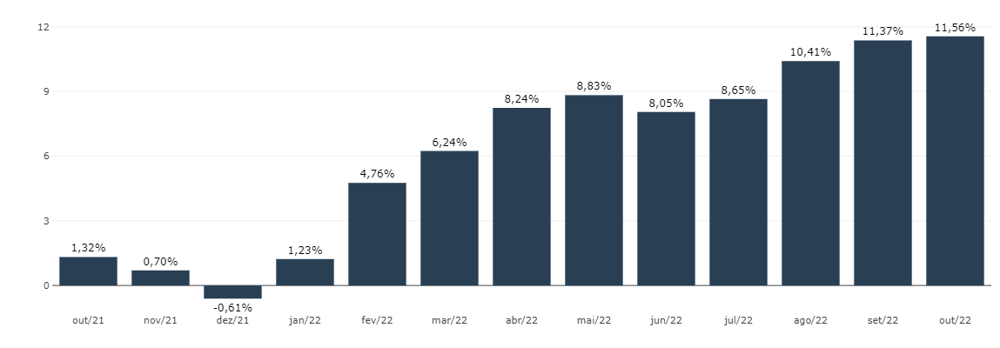
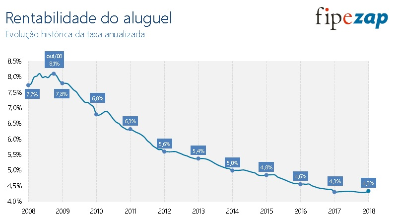

<!-- # O Método Comparativo -->

## O Método Comparativo {background-image="./img/FACULDADE_INBEC_16_9.png"}

- O Método Comparativo Direto de Dados de Mercado (MCDDM) tenta contornar a 
necessidade de estabelecimento de uma taxa de remuneração do capital, através da
pesquisa direta de dados de mercado de aluguéis de imóveis com diferentes 
características

- O Método Comparativo é o preferido quando existem dados de comparação 
disponíveis contemporâneos aos do avaliando

- É mais viável em algumas tipologias, como a de salas comercais, lojas, 
apartamentos, etc.

- Pode ser utilizado o *Tratamento Científico* (preferencialmente) e/ou o 
*Tratamento por Fatores*

- O *Tratamento por Fatores* acaba sendo bastante utilizado em algumas
tipologias devido à escassez de dados.

<!-- # Homogeneização de Comparativos -->

## Homogeneização de Comparativos {background-image="./img/FACULDADE_INBEC_16_9.png"}

- A homogeneização de elementos comparativos pode ser feita tanto no *Tratamento
Científico*, tanto no *Tratamento por Fatores*;

- A homogeneização de comparativos visa possibilitar uma comparação justa entre
os diversos elementos da amostra.

- Os dados devem ser homogeneizados quanto a:
  - Origem (oferta ou transação)
  - Atualização (data da contratação)
  - Periodicidade de reajuste
  - Luvas
  - Áreas Construídas de diferentes rentabilidades
    - Localização, Padrão Construtivo e Idade
  
## Origem {background-image="./img/FACULDADE_INBEC_16_9.png"}

- Quanto à origem, os dados podem ser homogeneizados com a aplicação do
*Fator Oferta*.

- Na falta de um *Fator Oferta* devidamente estimado, segundo @ibapesp15 [p. 156],
é usual que os dados de oferta sejam minorados em 10% "para cobrir eventual
superestimativa por parte do ofertante (elasticidade dos negócios)."

## Atualização de Aluguéis {background-image="./img/FACULDADE_INBEC_16_9.png"}

- A atualização de aluguéis é utilizada na aplicação do Método Comparativo de
Dados de Mercado

-   A existência de poucos dados de mercado contemporâneos exige que seja feita 
a comparação de dados de aluguéis contratados em perídos anteriores

-   Exemplo: calcular o aluguel vigente em maio/2018 [@damato, 75]:

. . .

```{r}
library(tibble)
library(knitr)
library(kableExtra)
df <- tribble(
  ~Id,       ~Inicio, ~Prazo, ~Aluguel, ~Reajuste, ~Indice,
    1,  "01/03/2014",   5*12,     1400,   "Anual", "IGP-M",
    2,  "12/06/2015",   5*12,     1350,   "Anual", "IGP-M",
    3,  "17/08/2015",   4*12,     1200,   "Anual", "IGP-M",
    4,  "12/09/2015",   4*12,     1164,   "Anual", "IGP-M"
)
kable(df)
```

## Atualização de Aluguéis {background-image="./img/FACULDADE_INBEC_16_9.png"}

- Por que sou contrário?
  -   Equilíbrio dos mercados imobiliário e de ativos
  -   Quando o primeiro contrato foi firmado, em março de 2014, a atividade econômica ainda estava acelerada (desemprego baixo, renda alta)
  -   Em 2015, a Atividade Econômica já havia caído bruscamente, o que afeta o mercado de aluguéis.

## Atualização de Aluguéis {background-image="./img/FACULDADE_INBEC_16_9.png"}

```{r}
#| out-width: "75%"

```

<!-- # Equilíbrio dos Mercados -->

## Choque de demanda {background-image="./img/FACULDADE_INBEC_16_9.png"}

```{r}
#| label: choqueDemanda
#| fig-cap: "Efeito de um choque de demanda (atividade econômica). Fonte: @diPasquale [apud @ADAMS2010]"
demand_property <- Hmisc::bezier(c(1, 1.5, 7), c(7, 3, 1)) %>%
  as_tibble()

demand_property_1 <- Hmisc::bezier(c(3, 3.5, 9), c(9, 3.5, 3)) %>%
  as_tibble()


plot_labels <- tibble(label = expression("D[1]", "D[2]"),
                      x = c(1, 3.5),
                      y = c(7.5, 9.5))
axis_labels <- tibble(label = expression("Aluguéis", "Estoque", 
                                         "Preço dos \n Imóveis", "Construção"),
                      x = c(-1.5, 9, -8.5, 2),
                      y = c(10, .5, 0, -10))

Mercados <- tibble(
  label = expression("Mercado de Bens: \n Determinação dos \nPreços",
                     "Mercado de Bens: \n Determinação da \nConstrução",
                     "Mercado Imobiliário: \n Determinação dos \nAluguéis",
                     "Mercado Imobiliário: \n Determinação do \nEstoque Residencial"), 
  x = c(-7.5, -7.5, 7.5, 7.5), y = c(8, -8, 8, -8)) 
Romans <- tibble(label = c("I", "II", "III", "IV"), 
                 x = c(8, -8, -8, 8),
                 y = c(4.5, 4.5, -4.5, -4.5))
library(ggplot2)
p1 <- ggplot(mapping = aes(x = x, y = y)) + 
  # geom_path(data = supply, color = "#0073D9", size = 1) + 
  geom_path(data = demand_property, color = "#FF4036", size = 1) +
  geom_path(data = demand_property_1, color = "#FF4036", size = 1) +
  annotate("segment", x = 1.25, xend = 3, y = 6, yend = 7.75, 
           arrow = arrow(length = unit(.5, "lines")), 
           size = 1, colour = "grey50") + 
  geom_hline(aes(yintercept = 0)) + 
  # geom_abline(slope = -1, size = 1) +
  geom_segment(aes(x = -7, y = 7, xend = 7, yend = -7), size = 1) +
  geom_vline(aes(xintercept = 0)) +
  geom_segment(aes(x = -7.5, y = -7.0, xend = -.75, yend = 0), size = 1) +
  geom_segment(aes(x = 3, y = 3.25, xend = -3.5, yend = 3.25), lty = "dotted") +
  geom_segment(aes(x = -3.5, y = 3.25, xend = -3.5, yend = -3), lty = "dotted") +
  geom_segment(aes(x = -3.5, y = -3, xend = 3, yend = -3), lty = "dotted") +
  geom_segment(aes(x = 3, y = -3, xend = 3, yend = 3.25), lty = "dotted") +
  geom_segment(aes(x = 4.5, y = 5, xend = -5.25, yend = 5), lty = "dashed") +
  geom_segment(aes(x = -5.25, y = 5, xend = -5.25, yend = -4.5), lty = "dashed") +
  geom_segment(aes(x = -5.25, y = -4.5, xend = 4.5, yend = -4.5), lty = "dashed") +
  geom_segment(aes(x = 4.5, y = -4.5, xend = 4.5, yend = 5), lty = "dashed") +
  geom_text(data = plot_labels, aes(x = x, y = y, label = label), 
            parse = TRUE)  +
  geom_text(data = axis_labels, aes(x = x, y = y, label = label),
            size = 4.5)  +
  geom_text(data = Mercados, aes(x = x, y = y, label = label), 
            size = 3.5) +
  geom_text(data = Romans, aes(x = x, y = y, label = label), 
            size = 4, fontface = "bold") +
  coord_equal() +
  labs(x = NULL, y = NULL, 
       title = "Choque de Demanda",
       caption = "Elaborado pelo Eng.º Luiz F. P. Droubi. Adaptado de DiPasquale e Wheaton (1996 apud Adams e Füss 2010)") +
  theme_classic() +
  theme(axis.line=element_blank(), 
        axis.title.y = element_text(angle = 0, hjust = .9)) +
  scale_x_continuous(expand = c(.025, .025), breaks = NULL, limits = c(-10, 10)) +
  scale_y_continuous(expand = c(.025, .025), breaks = NULL, limits = c(-10, 10))
p1
```

## Efeito de um aumento da taxa de juros de longo prazo {background-image="./img/FACULDADE_INBEC_16_9.png"}

```{r}
#| label: choqueJuros
#| fig-cap: "Efeito de um aumento de juros de longo prazo. Fonte: @diPasquale [apud @ADAMS2010]"
demand_property <- Hmisc::bezier(c(2, 3.5, 10), c(10, 3.5, 1)) %>%
  as_tibble()

plot_label <- tibble(label = "D", x = 2.75, y = 9.5)

p2 <- ggplot(mapping = aes(x = x, y = y)) + 
  # geom_path(data = supply, color = "#0073D9", size = 1) + 
  # geom_path(data = demand_property, color = "#FF4036", size = 1) +
  geom_path(data = demand_property, color = "#FF4036", size = 1) +
  annotate("segment", x = -7.5, xend = -6, y = 4, yend = 6, 
           arrow = arrow(length = unit(.5, "lines")), 
           size = 1, colour = "grey50") + 
  geom_hline(aes(yintercept = 0)) + 
  # geom_abline(slope = -1, size = 1) +
  geom_segment(aes(x = -6, y = 6, xend = 0, yend = 0), size = 1, lty = "dotted") +
  geom_segment(aes(x = -7.5, y = 4, xend = 0, yend = 0), size = 1) +
  geom_segment(aes(x = 0, y = 0, xend = 7, yend = -7), size = 1) +
  geom_vline(aes(xintercept = 0)) +
  geom_segment(aes(x = -7.5, y = -7.0, xend = -.75, yend = 0), size = 1) +
  geom_segment(aes(x = 5.75, y = 3.25, xend = -6, yend = 3.25), lty = "dotted") +
  geom_segment(aes(x = -6, y = 3.25, xend = -6, yend = -5.5), lty = "dotted") +
  geom_segment(aes(x = -6, y = -5.5, xend = 5.75, yend = -5.5), lty = "dotted") +
  geom_segment(aes(x = 5.75, y = -5.5, xend = 5.75, yend = 3.25), lty = "dotted") +
  geom_segment(aes(x = 4.5, y = 5, xend = -5.25, yend = 5), lty = "dashed") +
  geom_segment(aes(x = -5.25, y = 5, xend = -5.25, yend = -4.5), lty = "dashed") +
  geom_segment(aes(x = -5.25, y = -4.5, xend = 4.5, yend = -4.5), lty = "dashed") +
  geom_segment(aes(x = 4.5, y = -4.5, xend = 4.5, yend = 5), lty = "dashed") +
  geom_text(data = plot_label, aes(x = x, y = y, label = label), 
            parse = TRUE)  +
  geom_text(data = axis_labels, aes(x = x, y = y, label = label),
            size = 4.5)  +
  geom_text(data = Mercados, aes(x = x, y = y, label = label), 
            size = 3.5) +
  geom_text(data = Romans, aes(x = x, y = y, label = label), 
            size = 4, fontface = "bold") +
  coord_equal() +
  labs(x = NULL, y = NULL, 
       title = "Choque de Juros",
       caption = "Elaborado pelo Eng.º Luiz F. P. Droubi. Adaptado de DiPasquale e Wheaton (1996 apud Adams e Füss 2010)") +
  theme_classic() +
  theme(axis.line=element_blank(), 
        axis.title.y = element_text(angle = 0, hjust = .9)) +
  scale_x_continuous(expand = c(.025, .025), breaks = NULL, limits = c(-10, 10)) +
  scale_y_continuous(expand = c(.025, .025), breaks = NULL, limits = c(-10, 10))
p2
```

## Efeito do aumento de custos de construção {background-image="./img/FACULDADE_INBEC_16_9.png"}

```{r}
#| label: choqueCustos
#| fig-cap:  "Efeito de um aumento de custos de construção. Fonte: @diPasquale [apud @ADAMS2010]"
demand_property <- Hmisc::bezier(c(1, 3.75, 13.5), c(8, 3.75, 1.5)) %>%
  as_tibble()

plot_label <- tibble(label = "D", x = 2.75, y = 9.5)

p3 <- ggplot(mapping = aes(x = x, y = y)) + 
  # geom_path(data = supply, color = "#0073D9", size = 1) + 
  # geom_path(data = demand_property, color = "#FF4036", size = 1) +
  geom_path(data = demand_property, color = "#FF4036", size = 1) +
  annotate("segment", x = -6, xend = -8, y = -5.5, yend = -5.5, 
           arrow = arrow(length = unit(.5, "lines")), 
           size = 1, colour = "grey50") + 
  geom_hline(aes(yintercept = 0)) + 
  # geom_abline(slope = -1, size = 1) +
  geom_segment(aes(x = -7, y = 7, xend = 0, yend = 0), size = 1) +
  geom_segment(aes(x = 0, y = 0, xend = 7, yend = -7), size = 1) +
  geom_vline(aes(xintercept = 0)) +
  geom_segment(aes(x = -7.5, y = -7.0, xend = -.75, yend = 0), size = 1) +
  geom_segment(aes(x = -9.5, y = -7.0, xend = -2.75, yend = 0), size = 1, lty = "dashed") +
  geom_segment(aes(x = 4.5, y = 5, xend = -5.25, yend = 5), lty = "dotted") +
  geom_segment(aes(x = -5.25, y = 5, xend = -5.25, yend = -4.5), lty = "dotted") +
  geom_segment(aes(x = -5.25, y = -4.5, xend = 4.5, yend = -4.5), lty = "dotted") +
  geom_segment(aes(x = 4.5, y = -4.5, xend = 4.5, yend = 5), lty = "dotted") +
  geom_segment(aes(x = 3, y = 5.75, xend = -5.75, yend = 5.75), lty = "dashed") +
  geom_segment(aes(x = -5.75, y = 5.75, xend = -5.75, yend = -3), lty = "dashed") +
  geom_segment(aes(x = -5.75, y = -3, xend = 3, yend = -3), lty = "dashed") +
  geom_segment(aes(x = 3, y = -3, xend = 3, yend = 5.75), lty = "dashed") +
  geom_text(data = plot_label, aes(x = x, y = y, label = label), 
            parse = TRUE)  +
  geom_text(data = axis_labels, aes(x = x, y = y, label = label),
            size = 4.5)  +
  geom_text(data = Mercados, aes(x = x, y = y, label = label), 
            size = 3.5) +
  geom_text(data = Romans, aes(x = x, y = y, label = label), 
            size = 4, fontface = "bold") +
  coord_equal() +
  labs(x = NULL, y = NULL, 
       title = "Choque de Custos",
       caption = "Elaborado pelo Eng.º Luiz F. P. Droubi. Adaptado de DiPasquale e Wheaton (1996 apud Adams e Füss 2010)") +
  theme_classic() +
  theme(axis.line=element_blank(), 
        axis.title.y = element_text(angle = 0, hjust = .9)) +
  scale_x_continuous(expand = c(.025, .025), breaks = NULL, limits = c(-10, 10)) +
  scale_y_continuous(expand = c(.025, .025), breaks = NULL, limits = c(-10, 10))
p3
```

## Como entender o mercado imobiliário (1) {.smaller background-image="./img/FACULDADE_INBEC_16_9.png"}

1.  A pandemia de Covid-19 acarretou num aumento dos custos de construção, porém os juros de longo prazo também cederam:

. . .

```{r}
#| label: CC
#| fig-cap: "Elevação dos custos de construção"
#| out-width: "65%"

```

## Como entender o mercado imobiliário (1) {background-image="./img/FACULDADE_INBEC_16_9.png"}

- O aumento dos custos de construção diminui o *output* do mercado de 
construção, o que leva a uma diminuição do estoque, o que por sua vez aumenta o 
preço dos aluguéis.

## Como entender o mercado imobiliário (2) {.smaller background-image="./img/FACULDADE_INBEC_16_9.png"}

2.  Após a pandemia, os juros de longo prazo, que haviam caído, voltaram a elevar-se:

. . .

```{r}
#| label: JURO1
#| fig-cap: "Elevação dos juros no longo prazo"
#| out-width: "60%"

```

## Como entender o mercado imobiliário (3) {background-image="./img/FACULDADE_INBEC_16_9.png"}

-   O aumento dos juros de longo prazo diminue o apetite dos investidores por imóveis e impacta o mercado de construção, o que também leva a aumento dos aluguéis.

## Como entender o mercado imobiliário (4) {.smaller background-image="./img/FACULDADE_INBEC_16_9.png"}

-   Uma visão de prazo maior:

. . .

```{r}
#| label: SELIC
#| fig-cap: "Taxa Selic Real ex-post (evolução). Fonte: https://blogdoibre.fgv.br/posts/evolucao-historica-das-taxas-de-juros-reais-e-de-seus-determinantes-no-brasil"
#| out-width: "60%"

```

## Como entender o mercado imobiliário (5) {.smaller background-image="./img/FACULDADE_INBEC_16_9.png"}

3.  A atividade econômica vem se recuperando após o baque da pandemia de COVID-19:

. . .

```{r}
#| label: PIB2
#| fig-cap: "Recuperação do PIB após a pandemia"
#| out-width: "65%"

```

## Como entender o mercado imobiliário (6) {background-image="./img/FACULDADE_INBEC_16_9.png"}

-   O aumento da atividade econômica leva ao aumento do preço dos aluguéis.

## Como entender o mercado imobiliário (7) {.smaller background-image="./img/FACULDADE_INBEC_16_9.png"}

-   Resultado:

. . .

```{r}
#| label: IVAR
#| fig-cap: "Variação percentual acumulada em 12 meses."
#| out-width: "60%"

```

## Como entender o mercado imobiliário (8) {background-image="./img/FACULDADE_INBEC_16_9.png"}

-   Para melhor compreender o slide anterior:

. . .

```{r}
#| label: IVAR2
#| fig-cap: "Variação percentual acumulada em 12 meses."
#| out-width: "80%"

```

## Como entender o mercado imobiliário (9) {background-image="./img/FACULDADE_INBEC_16_9.png"}

-   Visão de mais longo prazo:

. . .

```{r}
#| label: rentabilidade
#| fig-cap: "Rentabilidade do Aluguel (% a.a.)"
#| out-width: "60%"

```

<!-- # Luvas -->

## Luvas {background-image="./img/FACULDADE_INBEC_16_9.png"}

- **Luvas**: luvas são a cobrança de uma certa importância no início da locação
(Candeloro, n.d., 70)
  - Pela atual legislação, as luvas só podem ser cobradas no início da locação, 
  porém não na renovação;
  - Para o tratamento equânime dos dados de aluguéis com ou sem luvas, estas,
  quando existentes, devem ser diluídas e acrescentadas ao valor mensal do 
  aluguel;
    - É necessário, para isto, aplicação de juros e correção monetária;
  
## Luvas {background-image="./img/FACULDADE_INBEC_16_9.png"}

- Exemplo [@damato, 169-170]:
  - Aluguel com contrato de 5 anos (60 meses).
    - Valor locatício mensal: R$ 2.000,00
    - Luvas: R$ 50.000
    - Selic: 9,25% a.a. (0,74% a.m.)
    - Correção monetária: 1,37% a.a. (0,114% a.m.)
- Solução:
  - Taxa efetiva: $(1+0,0074)\cdot(1+0,00114)-1=0,855\% \text{ a.m.}$
  - Fator de recuperação do capital: $\text{FRC}(0,855\%, 60) = 0,02137$
  - Aluguel: $$Al = 2.000 + 50.000 \cdot 0,02137 = \text{R\$ }3.067,00/\text{mês}$$

<!-- # Homogeneização de Áreas Construídas -->

## Depreciação {background-image="./img/FACULDADE_INBEC_16_9.png"}

- Independente do tratamento, é interessante conhecer os parâmetros do IBAPE/SP
para cálculo de valores de imóveis urbanos.

- Para o IBAPE/SP:
  - $V_I = V_T + V_B = (V_T + C_B).F_c$
    - $V_B$ é chamado de "Valor de Venda da Benfeitoria"
    - $F_c$ é um "*fator de comercialização*"
  - $V_B = \text{CUB-SP}\cdot P_C \cdot A_c \cdot F_{OC}$
    - $P_C$: Índice referente à tipologia e padrão
    - $A_C$: Área construída da edificação
    - $F_{OC}$: Fator de Adequação ao obsoletismo e ao estado de conservação
  
## Depreciação {background-image="./img/FACULDADE_INBEC_16_9.png"}

- A depreciação de um imóvel é feita, em geral, através da @eq-depreciacao
  - $$F_{OC} = R+K_D(1-R)$$ {#eq-depreciacao}
    - $R$: valor residual da edificação
    - $K_D$: coeficiente de depreciação, que pode ser calculado através de vários
  métodos
  
## Depreciação {background-image="./img/FACULDADE_INBEC_16_9.png"}

- Método de Ross-Heideck:

  - $$K_D = (1-E_c). \left [ 1-0,5\left (\frac{I_E}{I_R}+\frac{I_E^2}{I_R^2}\right) \right ]$$ {#eq-RossHeideck}
    - $I_E$: Idade da Edificação
    - $I_R$: Idade de Referência
    - $E_C$: Estado de Conservação (Heideck)

## Depreciação {background-image="./img/FACULDADE_INBEC_16_9.png"}

- Também é usual efetuar a depreciação pelo **método do valor descrescente**:
  - $$F_{OC}= (1-R)^{I_E}$$ {#eq-DBM}
    - $R$: Razão da Depreciação ($R = 1/I_R$)
  
## Depreciação {background-image="./img/FACULDADE_INBEC_16_9.png"}

| TIPO                                            | Vida útil | Razão    (%) |
|-------------------------------------------------|-----------|--------------|
| Barracos                                        | 25        | 4,0          |
| Residência Proletário Rústico a médio comercial | 67        | 1,5          |
| Residências médio superior a luxo               | 50        | 2,0          |
| Apartamentos e Escritórios                      | 40        | 2,5          |
| Armazéns e Indústrias                           | 67        | 1,5          |
| Construções de Madeira                          | 25        | 4,0          |

: Razões a considerar no método do valor decrescente
  
## Depreciação {background-image="./img/FACULDADE_INBEC_16_9.png"}

- Ou através do **método da linha reta**:
  - $F_{OC}= P_R + K_d.P_D$
    - $$K_d = \frac{I_R-I_E}{I_R}$$ {#eq-LinhaReta}
    - $P_R$: Parcela Residual (20%)
    - $P_D$: Parcela Depreciável (80%)
    - $I_E$: Idade da Edificação
    - $I_R$: Idade de Referência

## Apartamentos {.smaller background-image="./img/FACULDADE_INBEC_16_9.png"}

### @damato [p. 263-264]
    
```{r}
# Comparacao do tratamento por fatores e tratamento por regressao linear

# Carregamento dos pacotes necessarios
library(tibble)
library(effects)
library(broom)
library(appraiseR)
library(knitr)

# Insercao manual dos dados
# Dados de Alonso, Foz do Iguacu (2019, p. 48)

dados <- tribble(
  ~id, ~Area,  ~Aluguel, ~Condo, ~Padrao, ~Idade,
  1,    90,      2755,    285,  "Alto",     25,
  2,    87,      2310,    285, "Médio",     25,
  3,    90,      2215,    230,  "Alto",     30,
  4,    95,      1830,    230, "Baixo",     30,
  5,    90,      2000,    230,  "Alto",     30,
  6,   105,      1830,    290, "Médio",     25,
  7,   100,      1640,    250, "Baixo",     30,
  8, 93.69,        NA,    250, "Médio",     25,
)
kable(dados)
```
    
## Solução por fatores {.smaller background-image="./img/FACULDADE_INBEC_16_9.png"}
    
```{r}
dados <- within(dados, {
  k <- (1-.025)^Idade
  Fidade <- (1-.025)^25/k
  Fpadrao <- 1.926/ifelse(Padrao == "Alto", 2.16, 
                          ifelse(Padrao == "Médio", 1.926,
                                 ifelse(Padrao == "Baixo", 1.692, NA)))
  Fcondo <- (250/93.69)/(Condo/Area)
  Farea <- 93.69/Area
  Foferta <- 0.9
  PU <- Foferta*Aluguel/Area
})
dados$Ftotal <- with(dados, 1 + (Farea-1) + (Fcondo-1) + (Fpadrao-1) + (Fidade-1))
dados$PUhom <- with(dados, PU*Ftotal)
kable(dados, digits = 2)
```

-   Saneamento da amostra:
  
```{r}
#| echo: true
#| message: true
outlier_analysis(dados$PUhom, criterion = "Chauvenet")
```

-   PU médio homogeneizado: `r Reais(mean(dados$PUhom[-6], na.rm = T))`$/m^2$

## Apartamentos (2) {.smaller .scrollable background-image="./img/FACULDADE_INBEC_16_9.png"}

### @damato [p. 372]

```{r}
library(readxl)
dados <- read_excel("data/DamatoAlonso_p372.xlsx")
kable(dados, digits = 2, 
      format.args = list(big.mark = ".", decimal.mark = ","),
      col.names =c("Id", "Aluguel (R$)", "Venda (R$)", "Área Útil (m2)", 
                   "Condomínio (R$)", "Local", "Padrao", "Idade", "Vida útil",
                   "Conservação")) 
```

## Apartamentos (2) {.smaller background-image="./img/FACULDADE_INBEC_16_9.png"}

```{r}
dados <- within(dados, {
  C <- 1-sapply(dados$Conservacao, Heideck)
  k <- (1-C)*(1-.5*(Idade/VidaUtil + Idade^2/VidaUtil^2))
  Foc <- .2+.8*k
  PU <- .9*Aluguel/AreaUtil
  Condo <- Condominio/AreaUtil
  Padrao <- factor(Padrao)
  PadraoProxy <- ifelse(Padrao == "Medio", 1.926, 
                        ifelse(Padrao == "Superior", 2.406,
                               ifelse(Padrao == "Fino", 3.066, NA)))
})
dados <- within(dados,{
  FArea <- 78/AreaUtil
  FCondo <- 6.37/Condo
  FLocal <- 796/Local
  FPadrao <- 2.406/PadraoProxy
  FFoc <- .753/Foc
})
dados <- within(dados, SumFatores <- 1+ FArea + FCondo + FLocal + FPadrao + FFoc - 5)
dados <- within(dados, PUhom <- SumFatores*PU)
kable(dados, digits = 2, 
      format.args = list(big.mark = ".", decimal.mark = ","))
```
    
## Apartamentos (2)  {background-image="./img/FACULDADE_INBEC_16_9.png"}

-   Saneamento da amostra:

. . . 

```{r}
#| echo: true
outlier_analysis(dados$PUhom, criterion = "Chauvenet")
```

-   $PU_{hom} = \text{R\$ }$ `r brf(mean(dados$PUhom[-c(8,11)], na.rm = T))`/m2

## Lojas: Hipótese de Harper {background-image="./img/FACULDADE_INBEC_16_9.png"}

- A hipótese de Harper visa corrigir a área da loja para diferentes profundidades

- A hipótese de Harper considera que o preço médio do metro quadrado varia de
forma parabólica com relação à profundidade padrão para o local [@damato, p. 168]

- A hipótese implica que:
  - A primeira quarta parte da loja (da frente à via de acesso), corresponde à
  50% do valor da loja;
  - A segunda quarta parte equivale a 21%;
  - A terceira quarta parte equivale a 16%;
  - E a quarta quarta parte equivale a 13%.
  
- A hipótese de Harper não corrige o efeito de Frente da loja
  
## Lojas: Hipótese de Harper {background-image="./img/FACULDADE_INBEC_16_9.png"}

::::: columns
::: {.column width="50%"}
  
$$V_l = V_u \left (\sqrt{aSf_p}+A_p \right )$$ {#eq-Harper}


:::

::: {.column width="50%"}


- $a$: frente da loja 
- $S$: área da loja 
- $f_p$: fundo padrão (de 15 a 20m) 
- $A_P$: demais áreas


:::

::::


```{r}
#| out-width: "80%"
library(tibble)
df <- tribble(
  ~Id, ~Frente, ~Prof, ~Vl,
    1,       8,     8, 450, 
    2,       8,    10, 450,
    3,       8,    12, 500,
    4,       8,    14, 500,
    5,       8,    16, 500,
    6,       8,    18, 550,
    7,       8,    20, 600,
    8,       8,    22, 700,
    9,       8,    24, 750,
   10,       8,    26, 750,
   11,       8,    28, 785,
   12,       8,    30, 850
)
FundoPad <- 20
df <- within(df,{
  Area <- Frente*Prof
  VU <- Vl/Area
  Harper <- Area/sqrt(Frente*Area*FundoPad)
  VUhom <- VU*Harper
})
library(ggplot2)
ggplot(df, aes(x = Prof, y = 1/Harper)) +
  geom_line() +
  geom_point() +
  geom_hline(yintercept = 1, lty = "dotted") +
  geom_vline(xintercept = 20, lty = "dotted") +
  labs(title = "Hipótese de Harper para lojas",
       x = "Profundidade (m)", y = "Valor Unitário (R$/m2)",
       caption = "Com fundo padrão igual a 20m. VU para loja-padrão igual R$ 1,0/m2")
```
  
## Lojas: Hipótese de Harper {.smaller background-image="./img/FACULDADE_INBEC_16_9.png"}

### Exemplo [Adaptado de @damato, p. 168]:

::::: columns
::: {.column width="50%"}

- Seja a amostra:

```{r}
library(knitr)
kable(df[, c(1, 2, 3, 4)], format = "html",
      format.args = list(big.mark = ".", decimal.mark = ","),
      digits = 2
      #, caption = "Hipótese de Harper aplicada a lojas"
      ) 
```

:::

::: {.column width="50%"}

- Avaliar o aluguel de uma loja com 8x15$m^2$

- $$VU_{hom} = \frac{VU.S}{\sqrt{a.S.f_p.}}$$

- $$VU_{hom} = \frac{VU.S}{\sqrt{8.S.20}}$$

:::

::::

## Lojas: Hipótese de Harper {.smaller background-image="./img/FACULDADE_INBEC_16_9.png"}

### Solução:

::::: columns
::: {.column width="60%"}

- Homogeneização:

```{r}
library(appraiseR)
library(knitr)
kable(df[, c(1, 2, 3, 4, 8, 7, 6, 5)], format = "html",
      format.args = list(big.mark = ".", decimal.mark = ","),
      digits = 2
      #, caption = "Hipótese de Harper aplicada a lojas"
      ) 
```

:::

::: {.column width="40%"}

- $VU_{hom} =$`r Reais(mean(df$VUhom))`$/m^2$

- Avaliar o aluguel de uma loja com $8\times17,5 = 140m^2$:

- Homogeneização do avaliando: $S_{hom} = \sqrt{8.140.20} \approx 150,0 m^2$

- Valor Locatício: $Vl = S_{hom}.VU_{hom} = 150\times4,01$

- Valor Locatício: $Vl \approx \text{R\$ }600,00$

:::

::::

## Lojas: Hipótese de Harper {background-image="./img/FACULDADE_INBEC_16_9.png"}

### Exemplo 2:

- Com os dados do exemplo anterior, calcular o aluguel de uma loja com 8x22,5m2,
contando com mais 50$m^2$ de sobreloja (*mezzanino*)

- Solução:
  - $S_{hom} = \sqrt{8.180.20} + 50/2$
  - $S_{hom} = 169,70 + 25 = 194,70m^2$
  - $Vl = S_{hom}.VU_{hom} = 194,70\times4,01$
  - $Vl \approx \text{R\$ }780,75$/mês 

## Lojas: Tratamento Científico {background-image="./img/FACULDADE_INBEC_16_9.png"}

### @damato [p. 240]

-   37 dados de lojas de diferentes ramos

```{r}
library(forcats)
dados <- read_excel("./data/DamatoAlonso_p240.xlsx")
dados$Atividade <- factor(dados$Atividade)
dados$Atividade <- fct_reorder(dados$Atividade, dados$VU)
kable(head(dados, 6), digits = 2, 
      format.args = list(big.mark = ".", decimal.mark = ","))
```

## Lojas (análise exploratória) {background-image="./img/FACULDADE_INBEC_16_9.png"}

```{r, fig.cap="Lojas de shopping por atividade. Relação VU vs. Área."}
library(ggpmisc)
my.formula <- y ~ x
ggplot(dados, aes(x = Area, y = VU)) +
  stat_smooth(method = "lm") +
  geom_point(aes(x = Area, y = VU, color = Atividade)) +
  stat_poly_eq(formula = my.formula,
               eq.with.lhs = "italic(hat(y))~`=`~",
               label.x = "right", label.y = "top",
               aes(label = paste(..eq.label.., ..rr.label.., sep = "~~~")), 
               parse = TRUE) +
  theme(legend.position = "bottom")
```
    
## Lojas (modelo) {background-image="./img/FACULDADE_INBEC_16_9.png"}

```{r, out.width="100%", fig.width=12, fig.height=6}
fit <- lm(log(VU) ~ log(Area) + Andar + Atividade, dados)
plot(predictorEffects(fit, predictors = c("Area", "Atividade"), 
                      residuals = T), 
     id = T, axes=list(x=list(rotate=45)))
```

## Lojas {background-image="./img/FACULDADE_INBEC_16_9.png"}

```{r}
plot(predictorEffect("Andar", fit),
     axes=list(y=list(transform=exp, lab="VU")))
```

## Lojas {background-image="./img/FACULDADE_INBEC_16_9.png"}

```{r}
s <- summary(fit)
tabela <- tidy(fit)
tabela$term <- c("Intercepto", "log(Area)", "Andar Térreo", "Importados", 
                 "Tapetes", "Informática", "Fast-Food", "Esportes", 
                 "Roupas Masc.", "Roupas Fem.", "Bancos", "Jóias"
)
kable(tabela, digits = 2, format = "simple",
      format.args = list(big.mark = ".", decimal.mark = ","),
      col.names = c("Termo", "Estimativa", "Erro-padrão",
                    "Estatística t", "p-valor")) |>
  footnote(general = paste("Erro-padrão dos resíduos: ", 
                           brf(sigma(fit), digits = 2), 
                           " em ", df.residual(fit), " graus de liberdade."),
           alphabet = c(paste("R2: ", 
                              brf(R2(fit), digits = 2)),
                        paste("R2ajustado: ", 
                              brf(adjR2(fit), digits = 2)),
                        paste("RMSE: ",
                              brf(modelr::rmse(fit, data = dados), 
                                  digits = 2))
           ),
           escape = F)
```

## Lojas (avaliação) {background-image="./img/FACULDADE_INBEC_16_9.png"}

-   De posse do modelo acima, avaliar o valor mínimo do aluguel de uma loja 
de 110m2, de roupas masculinas no piso térreo neste shopping center.

. . . 
    
```{r}
#| echo: true
p <- predict(fit, newdata = list(Area = 110, Atividade = "roupas masculinas",
                                 Andar = "térreo"), 
             interval = "confidence", level = 0.80)
```

-   O valor calculado foi de: `r brf(exp(p[, "fit"]))` \[`r brf(exp(p[, "lwr"]))`; `r brf(exp(p[, "upr"]))`\]

## Terrenos {background-image="./img/FACULDADE_INBEC_16_9.png"}

### Considerações importantes

-   Primeiro há de se considerar o melhor uso, se comercial ou residencial
-   Terrenos residenciais, em geral, não são para locar.
-   Apenas os terrenos comerciais nos interessam aqui.
-   Deve-se dar preferência ao Método Comparativo
-   Problema: pode haver falta de dados para comparação
-   Com poucos dados, pode ser viável apenas o tratamento por fatores
-   Pode-se buscar dados de terrenos com construções para aumentar a amostra, 
descontando, é claro, o valor das construções para efeito de comparativo
-   Na ausência de dados em número suficiente, deve-se utilizar o Método da 
Remuneração do Capital


## Referências {background-image="./img/FACULDADE_INBEC_16_9.png"}
